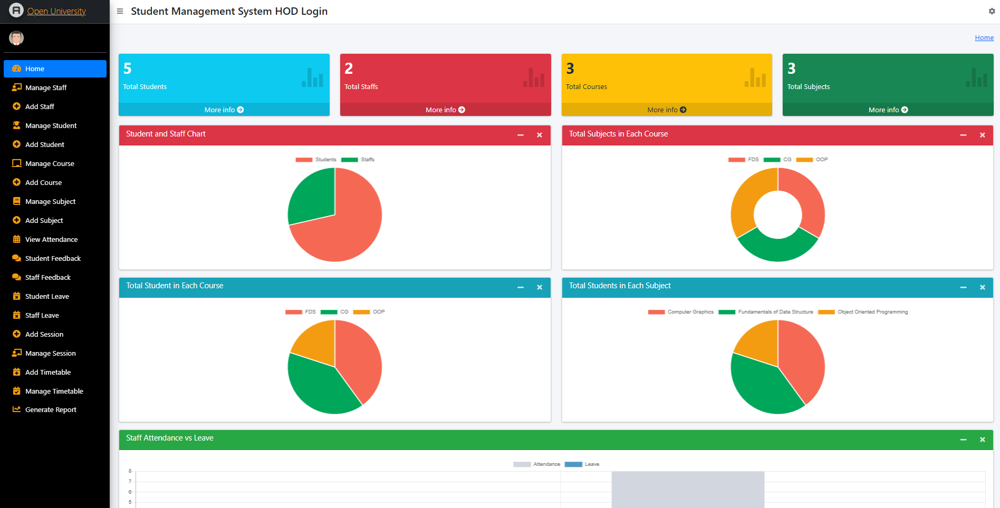
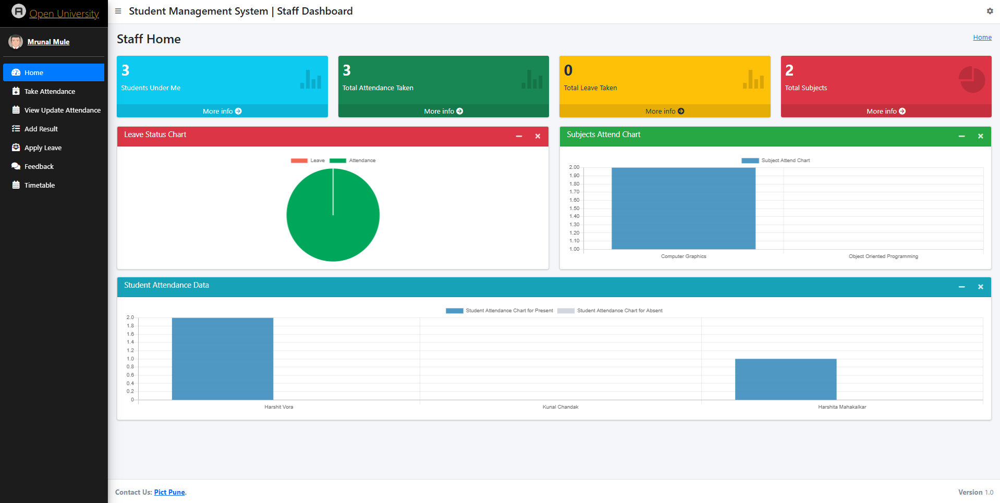
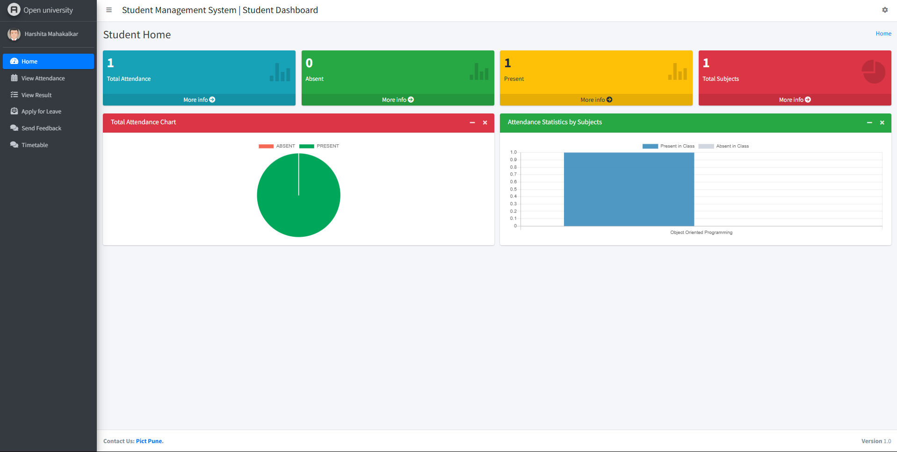
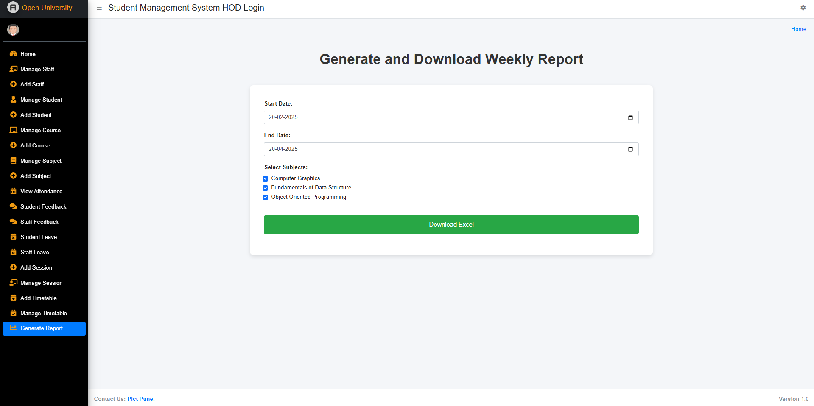

---

# 📘 **Django Student Management System **

Welcome to the **Django Student Management System**! 🎓✨
A simple yet powerful **Student Management System** built with **Python (Django)** for educational purposes.
Feel free to **customize** and enhance it as per your requirements.

⭐ If you like this project, don’t forget to **star the repository**! ⭐

---

## 🚀 **Features**

### ✅ **Admin Panel Features (HOD):**

* Dashboard overview with student, staff, and course statistics.
* **Staff Management**: Add, update, delete staff records.
* **Student Management**: Add, update, delete student records.
* Manage courses, subjects, and academic sessions.
* Track attendance reports.
* Review feedback from students and staff.
* Approve or reject leave applications.

### ✅ **Staff/Teacher Features:**

* View personal dashboard with subject details.
* Manage student attendance.
* Add and update student results.
* Apply for leave and send feedback to HOD.

### ✅ **Student Features:**

* Dashboard with attendance and performance charts.
* View attendance records and academic results.
* Apply for leave and send feedback to HOD.

---

## 🛠 **Installation Guide**

### **Step 1: Create Project Folder**

Create a folder where you want to keep the project files.

### **Step 2: Set Up Virtual Environment**

Install **virtualenv** and create a virtual environment:

```bash
pip install virtualenv
```

Create Virtual Environment:

* **Windows**:

  ```bash
  python -m venv venv
  ```
* **Mac/Linux**:

  ```bash
  python3 -m venv venv
  ```

Activate Virtual Environment:

* **Windows**:

  ```bash
  venv\Scripts\activate
  ```
* **Mac/Linux**:

  ```bash
  source venv/bin/activate
  ```

---

### **Step 3: Install Dependencies**

Install required packages using **requirements.txt**:

```bash
pip install -r requirements.txt
```

---

### **Step 4: Configure Allowed Hosts**

Edit `settings.py` and add:

```python
ALLOWED_HOSTS = ['*']
```

---

### **Step 5: Run Server**

Run the development server:

* **Windows**:

  ```bash
  python manage.py runserver
  ```
* **Mac/Linux**:

  ```bash
  python3 manage.py runserver
  ```

---

### **Step 6: Create Superuser (Admin)**

Create an admin account:

```bash
python manage.py createsuperuser
```

---

## 🔑 **Default Credentials**

| Role    | Email                                         | Password |
| ------- | --------------------------------------------- | -------- |
| Admin   | [admin@gmail.com](mailto:admin@gmail.com)     | admin    |
| Staff   | [mrunal@gmail.com](mailto:staff@gmail.com)     | mrunal    |
| Student | [harshita@gmail.com](mailto:student@gmail.com) | harshita  |


---

## 🖼 **Screenshots**

### 🔑 **Admin Dashboard**


### 👩‍🏫 **Staff Portal**


### 🎓 **Student Dashboard**


### 📊 **Reports Section**



---

## 📂 **Sample Deviation Report**
Download the **Deviation Report Excel File** here:  
➡ [Deviation Report (.xlsm)](screenshots/AI-DS Week 9 Deviation report.xlsx)  


---

## 📚 **About**

✅ Feel free to **fork**, **improve**, and share your contributions.
Happy Coding! 😃

---
